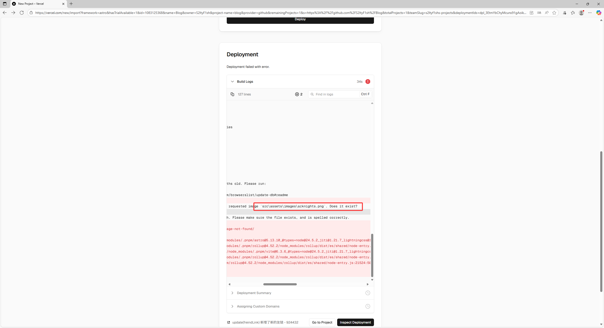
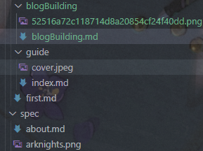
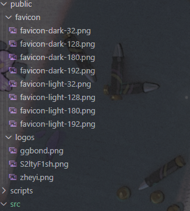

# 图片导入

## 场景描述1

需要在静态页面内导入图片时如果导入图片位置不正确可能会出现如下情况：

:::warning[]
Could not find requested image 'src\assets\imageslarknights.png'. Does it exist?
:::



然后爆红，部署失败

### 推测出现原因

- 在开发环境 (pnpm run dev) 中，Astro 的开发服务器比较宽松
- 在生产构建时，Astro 会严格检查所有静态资源路径
  
### 给出的解决方案

#### 直接在对应位置塞入图片文件，导入时用“./”快速导入

```markdown

```

## 场景描述2

本地测试`pnpm run dev`时没问题，但部署到vercel后资源丢失，显示不出来，如图：


### 推测出现原因

- 因为在构建时，Astro 不会将 /src/assets/ 路径直接映射到生产环境。在生产环境中，图片路径需要指向构建后的公共资源路径。
  
### 给出的解决方案

#### 使用非src\assets目录存放图片文件

在引用时只需简单直接的指向public目录，即可同时满足生产环境（部署时）和开发环境（测试时）
```typescript
		logo: "/logos/zheyi.png",
```